# Ideation Plugin

Transform brain dumps into structured implementation artifacts through a conversational interview. HTML is used for interactive decision-making (the Mission Brief contract with evidence-gate readiness, visual comparisons during the interview). Markdown is used for reference documents (specs, PRDs) consumed directly by `/ideation:execute-spec`. Includes an execution workflow for implementing specs in fresh sessions with per-component feedback loops, adversarial plan critics, a Scout/Reviewer agent pipeline, and a retro loop that feeds learnings back into future runs.

## What's New (0.14.0)

This release ships the full Fable 5 upgrade. Six behavior changes, plus one breaking schema change:

- **Evidence gates replace numeric confidence scoring.** Readiness is no longer a 0–100 score. Each of 5 dimensions is a gate that is `ready` or `not-ready`, justified by a concrete artifact. The contract proceeds only when all 5 are ready (or the user ends the interview early). See [Evidence Gates](#evidence-gates).
- **Registered agent types.** Scout, Reviewer, and the plan critics are registered agents (`ideation:scout`, `ideation:reviewer`, `ideation:plan-critic`) invoked with per-invocation inputs only — their workflow, output format, and read-only tool restrictions live in the agent definitions and are enforced by the platform.
- **Reviewer escape hatch.** During the review cycle the builder may _refute_ a finding the code demonstrably contradicts, citing file:line evidence. A refutation is logged and carried back to the reviewer, which either withdraws it or maintains it; a maintained finding becomes blocking and may not be refuted twice.
- **Adversarial plan critics.** Before the contract renders, three critics (`scope-creep`, `hidden-dependency`, `success-criteria`) review the plan in parallel while a blocker is still a one-line JSON edit. A Critic digest is shown at the approval gate. See [Plan Critics](#plan-critics).
- **Intake exploration sweep.** When the work touches an existing codebase, the interview fires 2–3 parallel `Explore` agents at intake so the first question is already informed. Skipped for greenfield work.
- **Previews-first decision aids.** Comparisons default to inline `AskUserQuestion` previews (monospace, side-by-side) and escalate to ephemeral HTML only when the decision hinges on real visual rendering.
- **Overlap-serialized parallel waves.** `/ideation:autopilot` and `--parallel` execution plan waves with a tested CLI that serializes any phases declaring overlapping `files`, so two phases never race the same file. See [Orchestration](#ideationautopilot).
- **Retro loop.** `/ideation:retro` mines a completed project's implementation notes for generalizable spec-gap patterns and appends them to a repo-level `docs/ideation/learnings.md` that future interviews read. See [Retro](#retro).
- **Command Deck contract design.** The contract HTML is redesigned as an instrument panel — dark-first with a co-equal light theme and an explicit theme toggle — surfacing the execution plan as an operational dashboard (run bar, phase table, copyable commands) rather than a static document. The artifact is still titled "Mission Brief".

> **Breaking change — `contract-data.json` schema.** The contract now uses a `gates` object instead of the old `confidence` object. Regenerating an old contract fails fast:
>
> ```
> contract-data.json uses the pre-gate `confidence` schema; regenerate via ideation to produce the `gates` schema.
> ```
>
> Re-run ideation on the project to produce a `gates`-shaped `contract-data.json`. Specs also gained an optional per-phase `files` manifest field (the paths a phase touches), used by the autopilot/parallel engine to serialize file-overlapping phases.

## Skills

### ideation

Transforms raw, unstructured brain dumps (dictated freestyle) into actionable implementation artifacts through an evidence-gated workflow.

Use this before building any new feature, planning a migration, designing a system, or turning scattered ideas into a plan. Covers small single-spec projects through multi-phase initiatives.

**How to invoke:**

```
Use the ideation skill

[provide your brain dump - messy dictation, scattered thoughts, half-formed ideas]
```

Or simply start with your brain dump and mention you want to turn it into specs:

```
I want to build something. Here's what I'm thinking...

[your raw, unstructured thoughts]

...can you help me turn this into a spec?
```

**The workflow:**

1. **Intake** - Accept your messy, unstructured input without judgment. Take a position upfront — what's strong, what's weak. On an existing codebase, fire a parallel exploration sweep so the first question is already informed.
2. **Interview loop** - One question at a time, each with a recommended answer. Explores the codebase inline — if it can look something up instead of asking, it does. Challenges vague demand, undefined terms, and hypothetical users. Loops until all 5 evidence gates are `ready`.
3. **Contract** - When all 5 gates are `ready`, three plan critics stress-test the plan in parallel; then generate `contract.html` via the contract-gen CLI. Command Deck instrument-panel layout with the gate readiness checklist, nested scope tiers (MVP / Full / Stretch), and copyable execution commands. Pick your scope tier in the terminal. Includes revision lineage tracking via `Supersedes` link.
4. **HTML visualizations** - During interview and phasing, decisions default to inline `AskUserQuestion` previews; ephemeral HTML pages (comparisons, mockups, architecture options) are reserved for decisions that need real visual rendering. Deleted after you choose.
5. **Phasing & specs** - Determine phases, generate Markdown specs with feedback loops and failure mode catalogs
6. **Feedback quality check** - Self-review specs for feedback loop coverage before presenting
7. **Execution handoff** - Phase track in contract, copy-to-clipboard ideation commands

**Output artifacts:**

All artifacts are written to `./docs/ideation/{project-name}/`:

```
_comparison.html               # Ephemeral decision aid (deleted after choice is made)
contract-data.json             # Machine-readable contract (source of truth; consumed by autopilot)
contract.html                  # Mission Brief contract (for review)
contract.md                    # Plain contract (for execute-spec lineage)
contract-{date}.html / .md     # Superseded revisions (lineage chain)
prd-phase-1.md                 # Phase 1 requirements (only if PRDs chosen)
spec-phase-1.md                # Implementation spec (for execute-spec)
spec-template-{pattern}.md     # Shared template for repeatable phases (if applicable)
spec-phase-N.md                # Per-phase delta or full spec
context-map.md                 # Scout's codebase map (written during execution)
implementation-notes-phase-1.html  # Decisions made during execution (per-phase)
```

HTML artifacts (contract, implementation notes, ephemeral visualizations) are self-contained single files with all CSS/JS inlined — no external dependencies. They open in your browser automatically. Features include:

- **Command Deck layout** — a single instrument-panel page: deck header, run bar, and sectioned panels (no tabs, no JS framework)
- **Readiness gate checklist** — a ✓/✗ per dimension with its one-sentence evidence citation in the hero (no score; readiness is binary)
- **Success criteria with checks** — each criterion renders its verifying command; criteria with no mechanical check carry a visible "judgment call" tag
- **Nested scope tiers** showing MVP / Full / Stretch commitment levels
- **Horizontal phase track** with risk coloring and gate support
- **Draft/Approved lifecycle** — a Draft contract shows the phase track as a plan preview with an "awaiting approval" note; run commands appear only once the contract is Approved (Phase 5)
- **Copy-to-clipboard buttons** on `/ideation:autopilot` and per-phase commands (Approved contracts)
- **Dark-first theming** with a co-equal light theme — auto/light/dark toggle persisted in `localStorage`; auto follows system preference

Specs and PRDs are Markdown — readable as-is and consumed directly by `/ideation:execute-spec`.

**Bundled references:**

Shared (plugin root):

- `interview-engine.md` - Shared interview engine (Phases 1-2), including the intake exploration sweep
- `confidence-rubric.md` - Evidence-gate criteria for readiness assessment and spec feedback quality
- `feedback-loop-guide.md` - Component-type mapping and design criteria for feedback loops

Skill-specific:

- `html-guide.md` - HTML component library, design tokens, and constraints (for ephemeral comparison/visualization artifacts; `contract.html` is rendered only by `scripts/contract-gen.ts`)
- `contract-template.md` - Markdown contract template (the HTML contract has no template — it is generator output)
- `prd-template.md` - PRD template
- `spec-template.md` - Implementation spec template (includes feedback loops and failure modes)

## Interview Loop

The core of the skill is a relentless one-question-at-a-time interview that builds shared understanding before writing anything. Key behaviors:

- **One question at a time** — no batching 3-5 questions. Ask, wait, ask next.
- **Recommended answer with every question** — the agent takes a position and lets you agree or redirect.
- **Explore instead of asking** — if the codebase can answer a question, the agent looks it up rather than asking you.
- **No question limit** — keeps interviewing until shared understanding. Say "stop" or "wrap up" to end early.
- **Anti-sycophancy** — banned phrases ("That's an interesting approach", "That could work") replaced with direct positions. Challenges vague demand, undefined terms, and hypothetical users.

## Failure Modes

Specs now include a **Failure Modes** section that catalogs how each non-trivial component can fail:

| Column       | Purpose                          |
| ------------ | -------------------------------- |
| Component    | Which component                  |
| Failure Mode | Named failure (not just "error") |
| Trigger      | What causes it                   |
| Impact       | What happens to user/system      |
| Mitigation   | How to handle or acknowledge     |

Trivial components (config, types, constants) skip failure mode enumeration — same rule as feedback loops.

## Implementation Notes

During execute-spec, the agent keeps a running `implementation-notes-phase-{N}.html` log of decisions it made that weren't covered by the spec — spec gaps, deviations, tradeoffs, codebase surprises, and dependency mismatches. Each entry records what the spec said (or didn't), what the agent chose, and what it rejected.

One file per phase. Opens in your browser automatically after execution. If the agent followed the spec without any judgment calls, no file is created.

## Contract Lineage

Contracts track revision history via a `Supersedes` link. When re-running ideation on the same project, the prior **Approved** `contract.html` is renamed to `contract-{date}.html` (and the sibling `contract.md` to `contract-{date}.md`) and the new contract references it, creating a traceable revision chain. Draft contracts are replaced in place — interview revisions and the same-session Draft→Approved flip don't accumulate snapshot files; only approved commitments earn lineage.

## Evidence Gates

Readiness is no longer a number. The skill judges your brain dump across 5 **gates**, each either `ready` or `not-ready`. A gate is `ready` only when a concrete artifact exists — a goal written as a pass/fail statement, an explicit scope boundary — not when a score is asserted.

| Gate             | Gate question                                                    |
| ---------------- | ---------------------------------------------------------------- |
| Problem Clarity  | Do I understand what problem we're solving, who has it, and why? |
| Goal Definition  | Are the goals specific and measurable?                           |
| Success Criteria | Can every stated goal be checked pass/fail today?                |
| Scope Boundaries | Do I know what's in and out of scope?                            |
| Consistency      | Are there contradictions I need resolved?                        |

**Proceed-to-contract rule:** all 5 gates `ready`, _or_ the user explicitly ends the interview ("stop" / "wrap up") — in which case the `not-ready` gates are recorded as such in the contract. Each gate carries a one-sentence `evidence` citation: the artifact that makes it ready, or the gap that keeps it not-ready.

Judgment is deliberately conservative — when unsure whether the evidence is sufficient, the gate is `not-ready`. One extra question costs seconds; a bad contract costs hours.

The contract HTML renders these as a per-gate ✓/✗ evidence checklist in the hero — there is no aggregate score, because a contract normally only exists when every gate is ready. The full criteria live in `confidence-rubric.md`.

## Plan Critics

Before the contract renders, three adversarial critics review the plan in parallel — while a blocker is still a one-line `contract-data.json` edit rather than a regenerate-review-regenerate loop:

| Lens                | Looks for                                                   |
| ------------------- | ----------------------------------------------------------- |
| `scope-creep`       | Scope items that should be a tier lower (or out of scope)   |
| `hidden-dependency` | Phases that depend on work an earlier phase doesn't deliver |
| `success-criteria`  | Goals that can't actually be checked pass/fail              |

Each critic returns `blocker` / `notable` / `nit` findings. Blockers are folded into the contract before it renders; notables are folded in if clearly right, otherwise dismissed with a reason; nits are mentioned only. A **Critic digest** appears at the approval gate so you can see the plan was stress-tested. Critics run **once** per contract and never block it — a failed or unregistered critic logs a warning and proceeds without that lens.

## Retro

`/ideation:retro [project-dir]` closes the learning loop. It mines a completed project's `implementation-notes-phase-*.html` for generalizable spec-gap patterns — gaps that would change how future specs or interviews are written — and appends them to a repo-level `docs/ideation/learnings.md` that future interviews read. It dedupes against existing entries; a phase that followed its spec cleanly produces zero learnings, and that is correct.

## Feedback Loops

Specs now include per-component feedback loops so the executing agent validates its work _during_ implementation, not just after.

Each spec defines a **Feedback Strategy** (top-level inner-loop command and playground type), and each iterative component gets:

- **Playground** - Environment to interact with (test suite, dev server, storybook, script harness)
- **Experiment** - Parameterized check with specific inputs and edge cases
- **Check command** - Fastest single validation, runs in seconds

Component types map to feedback mechanisms:

| Component Type         | Feedback Mechanism         |
| ---------------------- | -------------------------- |
| Data/logic layers      | Test file                  |
| UI components          | Dev server or Storybook    |
| API endpoints          | curl/httpie script         |
| CLI tools              | The tool itself            |
| Config/types/constants | Skip (typecheck covers it) |

Trivial components (config, types, constants) correctly skip feedback loops. The spec quality is self-reviewed (Strong/Adequate/Weak) before presentation.

## Example

**Input (messy dictation):**

```
okay so i'm thinking about this feature where users can like save their
favorite items you know like bookmarking but also they should be able to
organize them into folders or something maybe tags actually tags might be
better because folders are too rigid and oh we should probably have a
search too...
```

**Process:**

1. Skill accepts input, takes a position: "Strong: clear core feature. Weak: 'tags over folders' is preference, not evidence."
2. Interviews one question at a time with recommendations: "I'd scope this to articles — your app already has an Article model. Does that match?"
3. Explores codebase inline — finds existing tag system, recommends reusing it instead of asking
4. Challenges assumptions: "Have users complained about folders, or is this your gut?"
5. All 5 evidence gates reach `ready` after ~5 questions
6. Three plan critics stress-test the plan; then generates `contract.html` via contract-gen CLI — Command Deck layout with the gate readiness checklist, nested scope tiers, and copyable execution commands. Pick your scope in the terminal.
7. After approval, asks: "Straight to specs or PRDs first?"
8. At decision points (phasing, orchestration), opens side-by-side visual comparisons in browser
9. Generates Markdown specs with feedback loops and failure modes

**Result:** Mission Brief HTML contract for reviewing the plan, plus Markdown specs ready for `/ideation:execute-spec`.

## Full Workflow Diagram

```mermaid
flowchart TD
    subgraph IDEATION["<b>Ideation Skill</b> — Planning"]
        A["🧠 Brain Dump<br/><i>messy thoughts, dictation,<br/>scattered ideas</i>"] --> B["Take Position<br/><i>what's strong, what's weak</i>"]
        B --> C{"5 Evidence<br/>Gates Ready?"}
        C -->|"Not yet"| D["Interview Loop<br/><i>one question at a time,<br/>recommended answer,<br/>explore codebase inline</i>"]
        D --> C
        C -->|"All ready"| CR["Plan Critics<br/><i>scope-creep, hidden-dependency,<br/>success-criteria — parallel</i>"]
        CR --> E["Generate Contract<br/><i>Mission Brief: gate checklist,<br/>nested scope tiers, phase track</i>"]
        E --> F{"User<br/>Approval<br/>(pick scope tier,<br/>see critic digest)"}
        F -->|"Needs changes"| E
        F -->|"Approved"| G{"PRDs or<br/>straight to specs?"}
        G -->|"PRDs first"| H["Generate PRDs"] --> I
        G -->|"Straight to specs"| I["Generate Specs<br/><i>with feedback loops</i>"]
        I --> J["Self-Review<br/>Feedback Quality"]
        J -->|"Weak"| I
        J -->|"Strong/Adequate"| K["Write Execution Plan<br/><i>phase track,<br/>commands, agent team prompt</i>"]
        K --> L["📄 Artifacts in<br/>docs/ideation/project/"]
    end

    L -->|"fresh session"| M

    subgraph EXECUTE["<b>Execute-Spec Skill</b> — Implementation"]
        M["Load Spec"] --> N["🔭 Scout Agent<br/><i>read-only subagent</i>"]

        subgraph SCOUT["Scout — Codebase Learning"]
            N --> N1["Read spec + pattern files"]
            N1 --> N2["Explore: dependencies,<br/>conventions, test infra"]
            N2 --> N3{"Scope ready<br/>AND ≥ 4/5<br/>gates ready?"}
            N3 -->|"Below bar, round 1"| N2
            N3 -->|"Below bar, round 2"| N4["HOLD — escalate<br/>to user"]
            N3 -->|"GO"| N5["GO — return<br/>context map"]
        end

        N4 --> N6{"User<br/>choice"}
        N6 -->|"Proceed anyway"| O
        N6 -->|"Update spec"| M
        N6 -->|"Abort"| STOP["⏹ Stop"]
        N5 --> O["Write context-map.md"]
        O --> P["Parse Spec +<br/>Create Tasks"]
        P --> Q["Set Up Feedback<br/>Environment"]

        subgraph BUILD["Build Phase — Per Component"]
            Q --> R["Claim task"]
            R --> S["Read before writing<br/><i>consult context map</i>"]
            S --> T["Set up feedback loop<br/><i>playground + check cmd</i>"]
            T --> U["Build incrementally"]
            U --> V{"Check<br/>passes?"}
            V -->|"No"| W["Fix + re-check"] --> V
            V -->|"Yes"| X["Run experiment<br/><i>edge cases</i>"]
            X --> Y["Complete task"]
            Y --> Z{"More<br/>tasks?"}
            Z -->|"Yes"| R
        end

        Z -->|"All done"| AA

        subgraph REVIEW["Verify-Review-Fix Loop"]
            AA["▶ Verify<br/><i>typecheck, lint,<br/>tests, build</i>"]
            AA --> AB{"Verify<br/>passes?"}
            AB -->|"No"| AC["Fix validation errors"] --> AA
            AB -->|"Yes"| AD["📋 Reviewer Agent<br/><i>reads git diff + spec</i>"]

            subgraph REVIEWER["Reviewer — Spec-Aware Review"]
                AD --> AD1["Compare diff vs spec"]
                AD1 --> AD2["Check: spec-deviation,<br/>pattern-mismatch,<br/>logic, security,<br/>performance, testing"]
                AD2 --> AD3["Produce structured<br/>findings"]
                AD3 --> AD4{"Zero critical<br/>+ high?"}
            end

            AD4 -->|"PASS"| AE["✅ Commit"]
            AD4 -->|"FAIL, cycle < 3"| AF["Fix critical/high<br/>findings"]
            AF --> AA
            AD4 -->|"FAIL, cycle = 3"| AG{"User<br/>escalation"}
            AG -->|"Fix manually"| STOP2["⏹ User fixes"]
            AG -->|"Accept with issues"| AE
            AG -->|"Abort"| STOP3["⏹ No commit"]
        end

        AE --> AH["📊 Completion Report<br/><i>review summary,<br/>validation results,<br/>acceptance criteria</i>"]
    end

    AH -->|"next phase"| M

    style IDEATION fill:#1a1a2e,stroke:#e94560,color:#fff
    style EXECUTE fill:#1a1a2e,stroke:#0f3460,color:#fff
    style SCOUT fill:#16213e,stroke:#e94560,color:#fff
    style BUILD fill:#16213e,stroke:#0f3460,color:#fff
    style REVIEW fill:#16213e,stroke:#53a653,color:#fff
    style REVIEWER fill:#0a1628,stroke:#53a653,color:#fff
```



### Reading the Diagram

**Ideation (left/top)** — brain dump → evidence-gated questioning → plan critics → Mission Brief contract → specs → execution plan. Human approves at each gate.

**Execute-Spec (right/bottom)** — three phases per spec:

1. **Scout** explores codebase, produces context map (GO/HOLD gate)
2. **Build** implements components with per-component feedback loops
3. **Review** cycles verify → review → fix up to 3 times before commit

The loop between phases (`next phase → Load Spec`) shows multi-phase execution across fresh sessions, each loading the persisted context map.

### /ideation:execute-spec

Executes a spec file generated by the ideation skill. Invokes the Scout agent for codebase exploration, builds components with feedback loops, then runs a Verify-Review-Fix cycle with the Reviewer agent before committing.

**Usage:**

```bash
# Auto-detect next unblocked task from TaskList
/ideation:execute-spec

# Execute a specific spec
/ideation:execute-spec docs/ideation/my-project/spec-phase-1.md

# Parallel: spawn subagents for independent tasks
/ideation:execute-spec --parallel
```

**Why fresh sessions?**

- Ideation consumes significant context (contract, exploration, specs)
- Execution benefits from clean context focused solely on the spec
- Human review between phases catches issues early
- Each phase is independently committable

**The execution flow:**

1. Load and parse the spec file (and template if referenced)
2. **Scout** — invoke scout agent to explore codebase, produce persisted context map
3. Set up feedback environment — detect/start test runner, dev server, or storybook
4. Create tasks from implementation details with dependency tracking
5. **Build** — for each component: consult context map → set up feedback loop → build incrementally → check → iterate
6. **Verify** — run validation commands (typecheck, lint, tests, build)
7. **Review** — invoke reviewer agent to compare git diff against spec, produce structured findings
8. **Fix** — if critical/high findings, fix and re-verify/re-review (up to 3 cycles)
9. **Commit** — only after review passes or user accepts remaining issues

### /ideation:autopilot

Orchestrates full project execution — reads the contract, walks the phase dependency graph, and dispatches subagents to execute each spec. Parallel for independent phases, sequential for dependent ones.

**Usage:**

```bash
# Auto-detect contract
/ideation:autopilot

# Specify contract path
/ideation:autopilot docs/ideation/my-project/contract.md
```

**Behavior:**

- Reads `contract-data.json` for phase titles, dependencies, and spec paths (falls back to parsing the contract's Execution Plan for older projects)
- **Git skip pre-pass** — commits referencing a phase's slug-qualified spec path mark it complete, so re-running the command resumes where it left off, even across sessions
- Computes execution waves — groups of phases whose blockers are all satisfied; phases declaring overlapping `files` are serialized within a wave
- Dispatches each phase as a subagent with a clean context running `/ideation:execute-spec --headless`
- Independent phases within a wave run in parallel
- **Full auto** — continues without pausing on success
- **Gates on failure** — after the run, if any phase failed, pauses to ask: retry failed phases (resumes from where it stopped), stop here, or accept and finish; phases dependent on a failure are skipped automatically
- Each phase commits independently — completed work is durable even if later phases fail

> _The wave planning and parallel dispatch run on a deterministic [dynamic Workflow](https://claude.com/blog/introducing-dynamic-workflows-in-claude-code) engine in [`workflows/`](workflows/README.md) — see its README for the `args` contract and return shape._

**Example execution:**

```
Execution plan for bookmark-feature:
  Wave 1: Phase 1 (Core data model)
  Wave 2: Phase 2 (API endpoints) + Phase 3 (UI components)  [parallel]
  Wave 3: Phase 4 (Search integration)

4 phases across 3 waves. Starting now.

Wave 1/3: Phase 1 — PASS (abc1234)
Wave 2/3: Phase 2 + Phase 3 — PASS (def5678, ghi9012)
Wave 3/3: Phase 4 — PASS (jkl3456)

All 4 phases complete.
```

### get-goal-prompt

Generate a `/goal` command that runs the project **unattended** by driving `/ideation:autopilot`. The `/goal` is a durability wrapper — it keeps autopilot going across hours/sessions and recovers from failed phases — while autopilot's Workflow engine does the dependency-ordered dispatch. Copies the command to your clipboard; paste to start.

**Usage:**

```bash
# Auto-detect contract
/ideation:get-goal-prompt

# Specify contract path
/ideation:get-goal-prompt docs/ideation/my-project/contract.md
```

**How it works:**

- Reads the contract and project name
- Builds a short `/goal` whose objective is "run `/ideation:autopilot` to completion; on failure, fix and re-run; repeat until every phase is committed"
- The `/goal` does **not** inline per-phase steps — autopilot + the specs hold that detail
- Copies the `/goal` to clipboard and prints it; you paste to start

**When to use this vs. plain autopilot:**

- **`/ideation:autopilot`** — run it now and watch; lighter, interactive.
- **`get-goal-prompt` → `/goal`** — start it and walk away; durable across sessions, self-heals on failure. Same engine underneath.

## Execution model (engine · wrapper · unit)

Execution is layered — three roles, one engine underneath:

| Role        | What                                                                                                                                                                              | Reach for it when                                  |
| ----------- | --------------------------------------------------------------------------------------------------------------------------------------------------------------------------------- | -------------------------------------------------- |
| **Engine**  | `/ideation:autopilot` — drives the deterministic [Workflow](workflows/README.md) that plans dependency waves, dispatches phases in parallel, and returns schema-validated results | You want to run the project and watch it           |
| **Wrapper** | A `/goal` from `get-goal-prompt` — a durability layer that _drives_ autopilot across hours/sessions and recovers from failures                                                    | You want to start it and walk away (unattended)    |
| **Unit**    | `/ideation:execute-spec` — executes one phase (scout → build → verify-review-fix → commit)                                                                                        | You want fine-grained, one-phase-at-a-time control |

The wrapper drives the engine; the engine dispatches the unit. The graph shape
(parallel vs. sequential) is handled **inside** the engine — it doesn't change which
entry point you pick. ideation's handoff recommends one for you based on phase count and
whether you'll watch the run.

`/goal` is also the right tool for **exploratory** work that has no pre-written specs
(iterate-until-a-metric, prompt optimization) — there, you write the objective yourself
rather than generating it from a contract.

## Manual Cross-Session Execution

For manual control, run specs individually:

```bash
# Phase 1
/clear
/ideation:execute-spec         # auto-detects unblocked task
# ... implement, commit ...

# Phase 2
/clear
/ideation:execute-spec         # previous task completed, picks up next
# ... implement, commit ...
```

**Within a single phase, use `--parallel`:**

```bash
/ideation:execute-spec --parallel   # spawns subagents for independent components within the phase
```

## Installation

```bash
/plugin marketplace add tinetti/ideation
/plugin install ideation@ideation
```

## Acknowledgments

Forked from [nicknisi/ideation](https://github.com/nicknisi/ideation) by [Nick Nisi](https://github.com/nicknisi).
